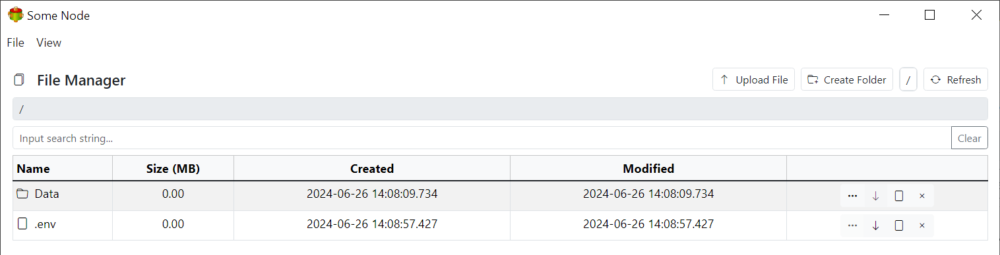

# Some Node

This project demonstrates creating the same application using various frameworks

- React Vanilla js

Application can be run on windows and linux

- For linux deb package example is provided
- For windows application it can be run as Windows service, Desktop App or Portable application

All required build scrips are provided

# About Some Node

Some mode is a basic file management application. It allows to upload/download/delete files and directories. It can be run as stand alone application or inside browser.

## Requirements

- nodeJs 20
- PKG (https://www.npmjs.com/package/@yao-pkg/pkg)

### Windows

- Innoscript
- Resource hacker
- Portable Apps Creator
- Portable Apps Installer

### Linux

- dpkg-deb

**Note** By no means this application is perfect, It can be improoved and it might contain some bugs.
